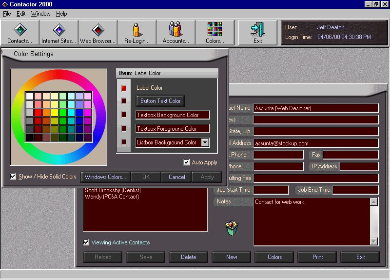



## A\+\+ Contactor 2000 \(With Speech\-See ScreenShot\)

### Description

Here is the link to the speech engine you will need from microsoft.com:

http://www.microsoft.com/iit/download/speechengines.htm?Yes=I+ACCEPT#_tts

Features: Speech, Record and Play Back your own Voice Messages using the MCI Control, Moving BorderLess Forms, How to make Custom Buttons that light up when you click on them, Read and Write to INI Files, Access an Access 2000 Database with a password in code, A custom Web Browser using the www control, Treeview Control with images, Custom Colors Form. Unzip the code to C:\CODE\CONTACTOR\. Load it up in VB6 and run it. You will need to download the Speech API's from Microsoft.Com if you want the speech portion to work. The Login name is "Guest" and the Password is also "Guest". If you have questions, you can e-mail me @ DEATREE@YAHOO.COM.
 
### More Info
 
1) Make a sub-directory called C:\CODE\CONTACTOR

2) Unzip the code to there.

3) Load it up in VB6 and run it.

4) Note: I'm using DAO 3.6 for the Access 2000 DB.

             |
---                |---
**Submitted On**   |2000-04-13 10:15:32
**By**             |[Jeff Deaton \(Aurthor\)](https://github.com/Planet-Source-Code/PSCIndex/blob/master/ByAuthor/jeff-deaton-aurthor.md)
**Level**          |Intermediate
**User Rating**    |4.3 (90 globes from 21 users)
**Compatibility**  |VB 6\.0
**Category**       |[Complete Applications](https://github.com/Planet-Source-Code/PSCIndex/blob/master/ByCategory/complete-applications__1-27.md)
**World**          |[Visual Basic](https://github.com/Planet-Source-Code/PSCIndex/blob/master/ByWorld/visual-basic.md)
**Archive File**   |[CODE\_UPLOAD47604132000\.zip](https://github.com/Planet-Source-Code/jeff-deaton-aurthor-a-contactor-2000-with-speech-see-screenshot__1-7013/archive/master.zip)

